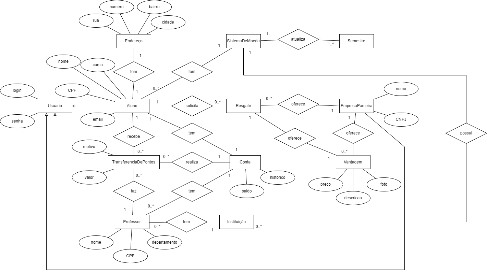

# Laboratório 03

- [Definições](#definições)

- [Diagrama de Caso De Uso](#diagrama-de-caso-de-uso)

- [Histórias do Usuário](#histórias-do-usuário)

- [Diagrama de Classes e Pacotes](#diagrama-de-classes-e-pacotes)

- [Diagrama de Componentes](#diagrama-de-componentes)

- [Diagrama de Implantação](#diagrama-de-implantação)

- [Modelagem ER](#modelagem-er)

- [Diagramas de Sequencia do Sistema](#diagramas-de-sequencia-do-Sistema)

## Definições

Sistema de Moeda Estudantil.

## Diagrama de Caso de Uso

## Histórias do Usuário

* US01 - Como Aluno, eu quero me cadastrar no sistema, para ter acesso ao Sistema de Moeda Estudantil.
* US02 - Como Aluno, eu quero selecionar uma das vantagens, para trocar moedas.
* US03 - Como Aluno, eu quero consultar o extrato, para saber quantas moedas ainda possuo.
* US04 - Como Aluno, eu quero consultar o extrato, para visualizar as transações de recebimento ou troca de moedas.
* US05 - Como Aluno, eu quero resgatar vantagens, para trocar moedas.
* US06 - Como Aluno, eu quero receber um email contendo o cupom do resgate solicitado, para que utilize na troca presencial.
* US07 - Como Aluno, eu quero ser notificado por email quando receber moedas, para saber se recebi alguma moeda.
* US08 - Como Usuário, eu quero logar no sistema, para ter acesso a aplicação.
* US09 - Como Empresa Parceira, eu quero me cadastrar no sistema, para ter acesso ao Sistema de Moeda Estudantil. 
* US10 - Como Empresa Parceira, eu quero cadastrar vantagens no sistema, para os alunos trocarem por suas moedas.
* US11 - Como Empresa Parceira, eu quero adicionar uma descrição ao produto, para poder cadastrar uma vantagem.
* US12 - Como Empresa Parceira, eu quero adicionar uma foto do produto, para poder cadastrar uma vantagem.
* US13 - Como Empresa Parceira, receber um email contendo o cupom do resgate solicitado, para que possa conferir a troca.
* US14 - Como Professor, eu quero enviar moedas para o Aluno, com o objetivo de reconhecimento pelo bom desempenho.
* US15 - Como Professor, eu quero verificar o saldo, para saber quantas moedas ainda possuo.
* US16 - Como Professor, eu quero informar o motivo do envio de moedas, para descrever o motivo da transação.
* US17 - Como Professor, eu quero consultar extrato, para saber os alunos que enviei moedas. 

## Diagrama de classes e pacotes

## Diagrama de Componentes

## Diagrama de Implantação

## Modelagem ER

Endereco (pk_id, fk_id_aluno, rua, numero, bairro, cidade)

Usuario (pk_login, senha)

Aluno (pk_id, nome, email, CPF, curso, fk_id_sistemaDeMoeda, fk_usuario)

Professor (pk_id, nome, cpf, departamento, fk_usuario)

TransferenciaDePontos (pk_id, motivo, valor, fk_aluno, fk_conta, fk_professor)

Conta (pk_id, saldo, historico, fk_professor, fk_usuario?)

Resgate (pk_id, fk_aluno, fk_vantagem, fk_empresaParceira)

Vantagem (pk_id, preco, descricao, foto, fk_empresaParceira)

EmpresaParceira (pk_CNPJ, nome, fk_usuario)

Instituicao (pk_id, fk_sistemaDeMoeda)

SistemaDeMoeda (pk_id)

Semestre (pk_id, fk_SistemaDeMoeda)

## Diagramas de Sequencia

UC01

UC02-04-05-06-07

UC03

UC08

UC09

UC10-11-12

UC13-14-15-16

UC17

